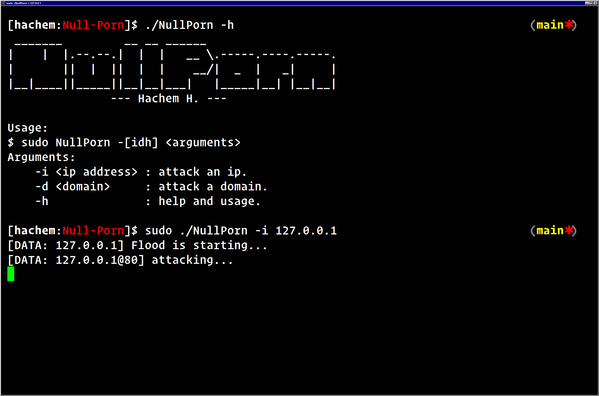

# Null-Porn
Null-Porn is a project born out of frustration with the increasing presence of pornographic and explicit content on platforms such as [YouTube](https://youtube.com)/[YouTube Shorts](https://shorts.youtube.com) and [TikTok](https://tiktok.com). These platforms have been inundated with spam bots that not only disrupt the user experience but also display offensive and inappropriate material. In response to this issue, I have taken the initiative to a `DDoS` attack which is usually capable to take them down as their security is usually weak. 

## Compatibility

This project is primarily optimized for Unix-based systems. It leverages the `curl`  library, which is commonly available on Unix systems. While it may also work on other operating systems, it is recommended to use a Unix system for the best compatibility and performance.

## Screenshots

_* Command line interface_

## Disclaimer

Although Null-Porn is an open-source project and its repository is publicly available, it is crucial to use this software responsibly and ethically. The purpose of this project is solely educational, intended to shed light on the techniques involved and the potential vulnerabilities of certain systems. **Under no circumstances should this project be used for any malicious or harmful activities.** Any misuse or unethical use of the scripts is strictly prohibited.

Please respect the principles of responsible usage and ensure that you adhere to legal and ethical standards when engaging with this project.
